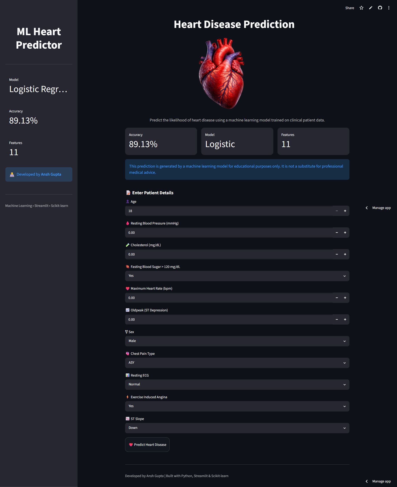
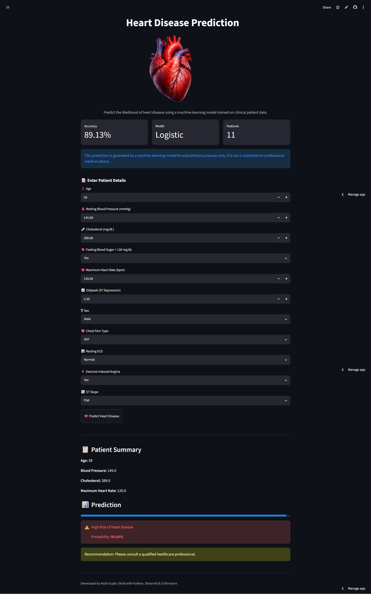

# ❤️ Heart Disease Prediction Using Machine Learning

A machine learning web application that predicts the likelihood of heart disease using patient clinical data. The project compares multiple machine learning algorithms and deploys the best-performing model using **Streamlit**.

---

# 🚀 Live Demo

🔗 **Try the application here**

https://heart-risk-estimator.streamlit.app/

---

# 📷 Application Preview

## 🏠 Home Page



---

## ❤️ Prediction Result



---

# 📌 Project Overview

Heart disease is one of the leading causes of death worldwide. Early prediction using machine learning can assist healthcare professionals in identifying high-risk patients and support timely medical intervention.

This project evaluates multiple machine learning classification algorithms and selects the best-performing model based on **Accuracy**, **Recall**, and **ROC-AUC Score**, then deploys the best model using Streamlit.

---

# 🎯 Objectives

- Predict heart disease using patient clinical data.
- Compare multiple machine learning models.
- Evaluate model performance.
- Deploy the best-performing model using Streamlit.
- Build a clean and interactive web application.

---

# 🛠️ Technologies Used

- Python
- Pandas
- NumPy
- Matplotlib
- Seaborn
- Scikit-learn
- XGBoost
- Streamlit
- Joblib
- Git
- GitHub

---

# 📊 Dataset

The dataset contains the following patient information:

- Age
- Sex
- Chest Pain Type
- Resting Blood Pressure
- Cholesterol
- Fasting Blood Sugar
- Resting ECG
- Maximum Heart Rate
- Exercise-Induced Angina
- Oldpeak
- ST Slope

### Target

Heart Disease (Yes / No)

---

# 🤖 Machine Learning Models Evaluated

| Model | Accuracy | Recall | ROC-AUC |
|-------|---------:|--------:|---------:|
| Logistic Regression | **89.13%** | **91.18%** | **0.9341** |
| Decision Tree | 77.17% | 82.35% | 0.8355 |
| Random Forest | 85.33% | 87.25% | 0.9252 |
| XGBoost | 88.04% | 89.22% | 0.9262 |

---

# 🏆 Best Performing Model

## Logistic Regression

- Accuracy: **89.13%**
- Recall: **91.18%**
- ROC-AUC: **0.9341**

Logistic Regression achieved the highest overall performance and was selected as the final deployed model because it provides excellent predictive performance while remaining simple and interpretable.

---

# 🚀 Features

- Interactive Streamlit dashboard
- Real-time prediction
- Machine Learning powered
- Probability score
- Patient summary
- Responsive interface
- Medical disclaimer
- Fast prediction response

---

# 📂 Project Structure

```text
Heart-Disease-Prediction/

│── data/
│     └── heart.csv
│
│── images/
│     ├── home.png
│     ├── predicted.png
│     └── heart.png
│
│── models/
│     ├── heart_disease_model.pkl
│     └── scaler.pkl
│
│── notebook/
│     └── HEART.ipynb
│
│── app.py
│── requirements.txt
│── README.md
│── LICENSE
│── .gitignore
```

---

# ⚙️ Installation

Clone the repository

```bash
git clone https://github.com/AnshForge/Heart-Disease-Prediction.git
```

Move into the project directory

```bash
cd Heart-Disease-Prediction
```

Install dependencies

```bash
pip install -r requirements.txt
```

Run the application

```bash
streamlit run app.py
```

---

# 📈 Project Workflow

1. Data Collection
2. Data Cleaning
3. Exploratory Data Analysis
4. Feature Engineering
5. Model Training
6. Model Evaluation
7. Model Selection
8. Streamlit Deployment

---

# 📊 Evaluation Metrics

The models were evaluated using:

- Accuracy
- Recall
- ROC-AUC Score

These metrics were selected because they provide a balanced evaluation of model performance for medical classification tasks.

---

# ⚠️ Disclaimer

This project is intended **for educational purposes only**.

The predictions generated by this application should **not** be considered professional medical advice, diagnosis, or treatment.

Always consult a qualified healthcare professional regarding any medical concerns.

---

# 👨‍💻 Author

**Ansh Gupta**

Engineering Student | Machine Learning Enthusiast

GitHub:
https://github.com/AnshForge

---

# 📄 License

This project is licensed under the MIT License.

---

# ⭐ Support

If you found this project helpful, consider giving it a ⭐ on GitHub.
